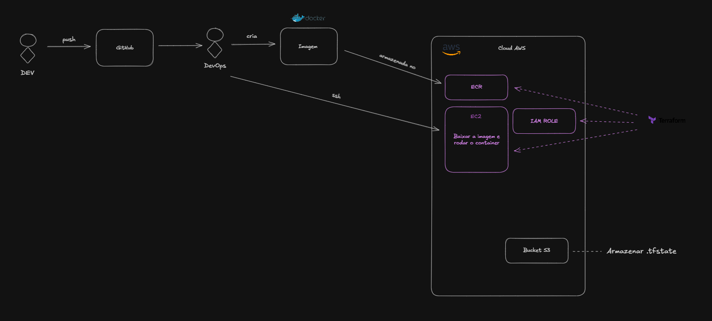

## Automatização de Infraestrutura com Terraform (IaC)

**Problema:** Na nossa startup fomos deparados com algumas dificuldades. Precisamos de recriar ambientes rapidamente, porém ao levantar a infraestrutura manualmente na AWS pode levar a inconsitências, erros e mudanças não rastreadas. Ou seja, um deploy pode falhar porque uma configuração foi esquecida no processo manual.

**Solução do Problema:** Levantar e preparar a infraestrutura como código com Terraform. Levantar recursos como EC2, ECR e IAM Roles em arquivos HCL, e o terraform provisiona tudo automaticamente.

**Ferramentas Aprendidas:** Terraform (init/plan/apply/destroy), backends remotos (S3 para state), outputs para integração.

**Conexão:** Integra com o Docker da phase 1 – agora a infra é reproduzível, mas o deploy ainda requer SSH manual. Isso motiva a full automation na phase 3.

